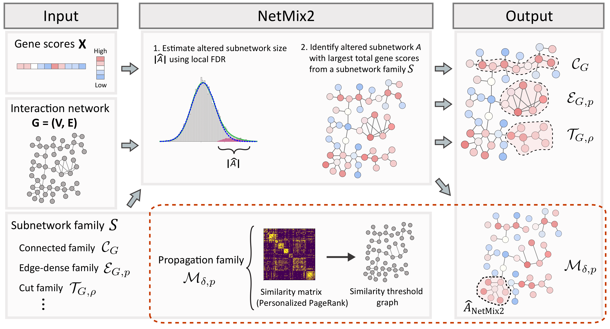

# NetMix2

NetMix2 is an algorithm for identifying altered subnetworks from a wide range of subnetwork families, 
including the **propagation family** which approximates the subnetworks ranked highly by network propagation. 

This repository includes instructions for installation and tutorials using example data for NetMix2.  
*This README is work in progress.*

## Algorithm



The main goal of NetMix2 is to identify the altered subnetwork in a subnetwork family from an interaction network of genes with gene scores.  
NetMix2 consists of two main steps:
1. Estimate the size of altered subnetwork.
2. Identify the altered subnetwork from a subnetwork family.

For step 1, NetMix2 uses local false discovery (local FDR) method to estimate the altered distribution and the background distribution from a set of gene scores. Local FDR uses a semi-parametric model that has weaker assumptions than the parametric Gaussian mixture model and thus can flexibly model a wide range of gene score distributions.  
For step 2, NetMix2 identifies the altered subnetwork with size estimated from step 1 and largest total vertex scores from an input subnetwork family. By default, NetMix2 uses the propagation family which approximates the altered subnetworks found by network propagation, thereby unifying the principles of network propagation with altered subnetwork identification.

## Setup

Setting up NetMix2 requires the following steps:

### Download

Download NetMix2 using the following command. This command clones the NetMix2 repository from Github.

`git clone https://github.com/raphael-group/netmix2.git`

### Requirements

NetMix2 is written in Python 3 and requires several dependencies listed below.  
We recommend `virtualenv` or `conda` for managing the required dependencies.

- Python (3.6)
- NumPy
- SciPy
- Matpotlib
- pandas
- statsmodels
- Gurobi

In addition, NetMix2 requires locfdr-python (v0.1a) package from https://github.com/leekgroup/locfdr-python.
Users can choose to install the code from the original source or use the code in this repo which we modified to use with Python 3.

### Testing NetMix2
NetMix2 using the *propagation family* can be executed on example data using the following command.
```
python run_netmix2.py -el data/edge_list.tsv -gs data/gene_scores.tsv -o results/example_output.tsv
```
Detailed instructions for running NetMix2 including the input file format and command-line options are described below. 


## Usage

NetMix2 uses the *propagation family* by default.  
For this subnetwork family, NetMix2 constructs the similarity threshold graph using a similarity matrix where each entry in the matrix is the Personalized PageRank between a pair of vertices in the original graph.
The propagation family is then equal to the edge-dense family for the similarity threshold graph.

Instructions for using other subnetwork families are described in Additional Infromation.

### Input

NetMix2 requires two tab-separated text file - an edge list for interaction network and a gene scores file. 

The following example demonstrates a network with three vertices `A`, `B`, and `C` that have gene scores (P-values) of `0.1`, `0.5`, and `0.9`, respectively.


#### Edge list file
Each row in this file corresponds to an edge in the network.

    A    C
    B    C

#### Gene-to-score file
Each line in this file associates a node with a score:

    A    0.1
    B    0.5
    C    0.9

#### Parameters for the propagation family
In addition to the files above, running NetMix2 using the propagation family requires two family-specific parameters:
- Similarity threshold. Alternatively, users can choose the number of edges in the similarity threshold graph.
- The minimum edge density of the altered subnetwork in the similarity threshold graph.

Below are the command line options for NetMix2.

### NetMix2 (*propagation family*) command line options
| Flag | Name | Description |
| --- | --- | --- | 
| -el | edge_list | Edge list file | 
| -gs | gene_scores | Gene-to-score file |
| -d | delta | The similarity threshold |
| -ne | num_edges | The number of edges in similarity threshold graph | 
| -p | density | The minimum edge density of the altered subnetwork |
| -t | time_limit | Time limit for running the Gurobi solver | 
| -o | output | Directory for the NetMix2 output |


### Output
NetMix2 outputs a list of vertices corresponding to the altered subnetwork. Each line in the output file is a vertex:

    B
    C


## Additional information

### Tutorial
A tutorial with step-by-step instructions for NetMix2 is available in the Jupyter notebook.

### Running NetMix2 using other subnetwork families
In addition to the propagation family, users can also choose to run NetMix2 using one of the following subnetwork families:

- Connected family 

Execution command:  
` python run_netmix2_connected -el [EDGE_LIST] -gs [GENE_SCORES] (-o [OUTDIR])`

- Edge-dense family  

Execution command:  
` python run_netmix2_edge_dense -el [EDGE_LIST] -gs [GENE_SCORES] -p [MINIMUM_EDGE_DENSITY] (-o [OUTDIR])`

- Cut family 

Execution command:  
` python run_netmix2_connected -el [EDGE_LIST] -gs [GENE_SCORES] -rho [MAXIMUM_CUTSIZE] (-o [OUTDIR])`


Please refer to the NetMix2 manuscript for defition of each subnetwork family.

## Contacts

NetMix2 has been developed by members of the research group of prof. Ben Raphael at Princeton University.
For any related question, please email Uthsav Chitra (uchitra@princeton.edu) or Tyler Park (typark@princeton.edu).


### License
See `LICENSE` for license information.
### Citation
The NetMix2 manuscript is currently under review and will be available soon.